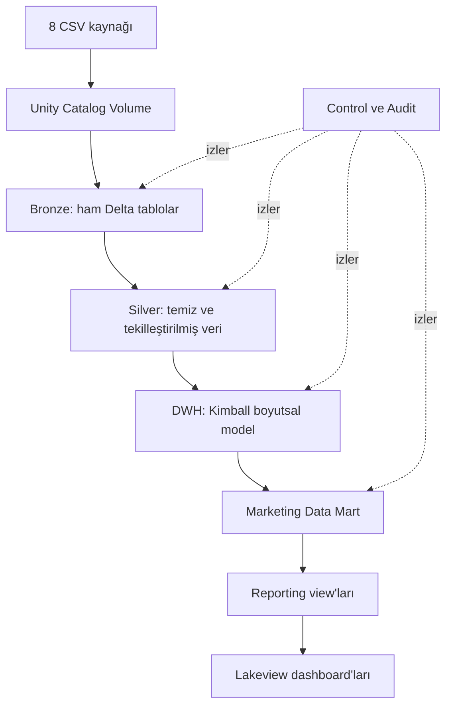

# Retail Marketing Analytics Lakehouse

Databricks üzerinde sekiz ilişkili perakende ve pazarlama veri kaynağını uçtan uca işleyen; Medallion mimarisi, Kimball boyutsal model, pazarlama Data Mart'ları, veri kalite kontrolleri, ETL izleme ve Lakeview dashboard'larını bir araya getiren veri mühendisliği projesi.

> Projenin ana veri hattı günlük ve tekrar çalıştırılabilir ETL senaryosu için tasarlanmıştır. Ayrıca kısıtlı Databricks ortamlarında tek notebook ile çalışabilecek bağımsız bir full-snapshot demo sürümü bulunmaktadır.

## Projenin amacı

Ham CSV dosyalarını yalnızca görselleştirmek yerine aşağıdaki ihtiyaçları tek bir mimaride çözmek hedeflenmiştir:

- Ham veriyi izlenebilir metadata ile Delta tablolara almak
- Geçersiz ve tekrarlı kayıtları kontrol ederek temiz bir Silver katmanı üretmek
- Kimball yaklaşımıyla ortak dimension ve birden fazla fact tablosu oluşturmak
- Satış, ürün, kampanya ve promosyon analizleri için Data Mart'lar hazırlamak
- Her batch'i tablo ve veri kalite düzeyinde izlemek
- İş sonuçlarını Databricks SQL/Lakeview dashboard'larında sunmak
- Aynı gün veya batch yeniden çalıştırıldığında güvenli sonuç üretmek

## Mimari



Catalog adı `retail_marketing` olarak sabittir. Kullanılan şemalar:

| Şema | Sorumluluk |
| --- | --- |
| `source` | Unity Catalog Volume ve kaynak dosyalar |
| `bronze` | Kaynağa yakın ham Delta tablolar |
| `silver` | Temizlenmiş, standardize edilmiş ve tekilleştirilmiş tablolar |
| `dwh` | Kimball dimension ve fact tabloları |
| `dm_marketing` | Pazarlama odaklı özet tablolar ve raporlama view'ları |
| `control` | Batch durumu ve watermark altyapısı |
| `audit` | Tablo yükleme ve veri kalite logları |

## Veri kaynakları

Proje, 84.51° Complete Journey veri ailesindeki aşağıdaki sabit dosya adlarını bekler:

| Dosya | İçerik | Yükleme yaklaşımı |
| --- | --- | --- |
| `transaction_data.csv` | Sepet-ürün seviyesinde satış işlemleri | Gün bazlı yeniden yükleme |
| `coupon_redempt.csv` | Kupon kullanım hareketleri | Gün bazlı yeniden yükleme |
| `product.csv` | Ürün ana verisi | Snapshot |
| `hh_demographic.csv` | Hane demografisi | Snapshot |
| `campaign_desc.csv` | Kampanya tanımları ve gün aralıkları | Snapshot |
| `campaign_table.csv` | Kampanya-hedef hane ilişkileri | Snapshot |
| `coupon.csv` | Kupon-ürün-kampanya ilişkileri | Snapshot |
| `causal_data.csv` | Ürün-mağaza-hafta promosyon bilgileri | Hafta/snapshot |

Ham veri dosyaları boyut ve dağıtım koşulları nedeniyle repository'ye dahil edilmemiştir. Veri sözlüğü ve kaynak hakkında [Complete Journey paket dokümantasyonu](https://bradleyboehmke.github.io/completejourney/) incelenebilir.

Dosyalar Databricks'te şu konuma yüklenmelidir:

```text
/Volumes/retail_marketing/source/source_files/master/
```

## Boyutsal veri modeli

Proje tek bir star schema yerine, ortak dimension'ları kullanan bir fact constellation/galaxy yapısı kurar.

### Dimension tabloları

- `dim_product`
- `dim_household`
- `dim_campaign`
- `dim_store`
- `dim_coupon`
- `dim_day`

Her dimension surrogate key kullanır. `-1`, doğal anahtarı bulunamayan veya geçersiz kayıtlar için unknown member'dır. Mevcut sürüm dimension değişikliklerini SCD Type 1 yaklaşımıyla uygular.

### Fact tabloları ve grain

| Fact | Grain |
| --- | --- |
| `fact_sales_transaction` | Bir sepet içindeki bir ürün satırı |
| `fact_coupon_redemption` | Bir hanenin belirli bir günde kullandığı bir kupon |
| `fact_campaign_target` | Bir kampanyaya hedeflenen bir hane |
| `fact_promotion_weekly` | Bir ürünün bir mağazada bir haftadaki promosyon durumu |

### Marketing Data Mart'ları

| Tablo | Sağladığı analiz |
| --- | --- |
| `dm_daily_sales` | Günlük satış, sepet, müşteri, indirim ve kupon KPI'ları |
| `dm_product_sales` | Ürün, marka, departman ve kategori performansı |
| `dm_campaign_performance` | Hedeflenen/kullanan hane, redemption ve kampanya performansı |
| `dm_promotion_performance` | Display/mailer türü, ürün-mağaza-hafta satış ve indirim sonuçları |

## ETL ve tekrar çalıştırılabilirlik

`04_prepare_run_parameters.py`, son başarılı batch'in gününü bulur ve bir sonraki çalışma için şu değerleri üretir:

- `BatchID`
- `LoadMode`
- `ProcessDate`
- `ProcessDay`
- `ProcessWeek`

Günlük işlem tablolarında aynı `BatchID` önce temizlenip yeniden yazılır. Master tablolar snapshot olarak alınır; Silver katmanında natural key veya record hash üzerinden tekilleştirme uygulanır. Dimension tabloları `MERGE`, fact ve Data Mart tabloları ise batch-scope delete/insert yaklaşımıyla tekrar çalıştırılabilir tutulur.

Job bağımlılıkları ve notebook parametre eşleştirmesi için [Databricks Job Kurulum Rehberi](docs/DATABRICKS_JOB_SETUP.md) kullanılmalıdır.

## Veri kalitesi ve gözlemlenebilirlik

Runtime veri kalite notebook'larında toplam 85 ayrı kontrol tanımlıdır:

| Katman | Kontrol sayısı | Örnekler |
| --- | ---: | --- |
| Bronze | 19 | Zorunlu alan, gün uyumu, metadata, duplicate, doluluk |
| Silver | 21 | Natural key, tekillik, tarih kuralları, referential integrity |
| DWH | 28 | Dimension/fact doluluğu, grain, surrogate key RI, mutabakat |
| Data Mart | 17 | Grain, oran/tutar sınırları, gün-hafta uyumu, DWH mutabakatı |

İki temel izleme tablosu kullanılır:

- `audit.etl_table_load_log`: kaynak/hedef satır sayıları, insert/reject/unchanged değerleri, süre ve durum
- `audit.data_quality_log`: kontrol adı, kategori, önem seviyesi, başarılı/başarısız satır sayıları ve hata oranı

`51_finalize_batch.py`, dört katmanın ETL ve DQ sonuçlarını birlikte değerlendirerek batch'i `SUCCESS`, `SUCCESS_WITH_WARNING` veya `FAILED` durumuyla kapatır.

## Dashboard'lar

Ana Lakeview export'u `ETL Retail Marketing Performance Dashboardv2.lvdash.json` dosyasıdır. Beş sayfa ve 63 widget içerir:

1. Executive Overview
2. Product & Customer Performance
3. Campaign & Promotion Analysis
4. Customer Segmentation & Behavior
5. ETL & Data Quality Monitoring

Diğer dosyalar:

- `Retail Marketing Performance Dashboardv2.lvdash.json`: full-snapshot demo şemalarını kullanan dashboard
- `Retail Marketing Performance Dashboard.lvdash.json`: ilk/legacy dashboard export'u
- `00_DEMO_FULL_SNAPSHOT_DASHBOARD.py`: bütün CSV'leri tek seferde okuyup demo Bronze-Silver-Gold-Data Mart yapısını kuran alternatif akış

## Klasör yapısı

```text
.
├── 00_SETUP/
│   ├── 00_create_environment.py
│   ├── 01_create_control_and_audit_tables.py
│   ├── 02_create_layer_tables.py
│   └── 04_prepare_run_parameters.py
├── 01_BRONZE/
├── 02_SILVER/
├── 03_DWH/
├── 04_DATA_MART/
├── 05_JOB/
├── docs/
├── 00_DEMO_FULL_SNAPSHOT_DASHBOARD.py
├── ETL Retail Marketing Performance Dashboardv2.lvdash.json
├── Retail Marketing Performance Dashboardv2.lvdash.json
└── Retail Marketing Performance Dashboard.lvdash.json
```

## Kurulum ve çalıştırma

### Gereksinimler

- Unity Catalog erişimi olan Databricks workspace
- Catalog, schema, Volume ve Delta table oluşturma yetkileri
- Python/PySpark destekli Databricks compute
- Dashboard için Databricks SQL Warehouse
- Sekiz kaynak CSV dosyası

### İlk kurulum

Notebook'ları Databricks workspace'e import ettikten sonra sırasıyla çalıştırın:

1. `00_SETUP/00_create_environment.py`
2. `00_SETUP/01_create_control_and_audit_tables.py`
3. `00_SETUP/02_create_layer_tables.py`
4. CSV dosyalarını `/Volumes/retail_marketing/source/source_files/master/` altına yükleyin.
5. [Job kurulum rehberindeki](docs/DATABRICKS_JOB_SETUP.md) task zincirini oluşturun.
6. Lakeview dashboard JSON'unu import edin ve SQL Warehouse bağlantısını seçin.

Yalnızca hızlı tanıtım gerekiyorsa kaynak dosyaları yükledikten sonra `00_DEMO_FULL_SNAPSHOT_DASHBOARD.py` çalıştırılabilir. Bu akış ana günlük pipeline'dan bağımsız `demo_*` şemalarını kullanır.

## Uygulanan repository düzeltmeleri

GitHub'a hazırlık sırasında kodun genel davranışı korunarak aşağıdaki tutarsızlıklar giderilmiştir:

- Kurulum Volume adı kaynak notebook'larıyla `source_files` olarak eşleştirildi.
- Audit tablosundaki `LoadType`/`LoadStrategy` kolon uyuşmazlığı düzeltildi.
- Setup sırasında örnek batch ekleyen ve DQ loglarını temizleyen yan etkili test hücreleri kaldırıldı.
- Günlük KPI view'ındaki SQL sözdizimi ve `NetSalesAmount` alanı düzeltildi.
- Brüt satış, net satış ve toplam indirim ilişkisi ana fact akışında tutarlı hale getirildi.
- Kupon oranları satır sayısı yerine distinct sepet üzerinden hesaplandı.
- Dashboard'daki negatif indirim işareti ve gereksiz kampanya join'i düzeltildi.
- Kampanya ROI sorgusundaki sınırsız cross join, batch ve kampanya haftasıyla sınırlandı.

Ayrıntılı inceleme ve kalan teknik borçlar için [Proje Analizi](docs/PROJECT_ANALYSIS.md) dosyasına bakın.

## Mevcut kapsam ve yol haritası

Tamamlanan kapsam; ETL, Lakehouse katmanları, Kimball DWH, Data Mart, kalite kontrolleri, audit ve dashboard'lardır.

Planlanan fakat bu repository'de henüz uygulanmamış genişletme, geçmiş satışlardan gelecekte öne çıkabilecek ürünleri tahmin eden agentic analytics katmanıdır. Önerilen geliştirme sırası:

1. Ürün/ürün grubu bazında günlük veya haftalık talep serisi üretmek
2. Naive baseline, Prophet/ARIMA ve ağaç tabanlı modelleri rolling backtest ile karşılaştırmak
3. MAE, RMSE, WAPE ve bias metrikleriyle model seçmek
4. Tahminleri yeni bir Gold/Data Mart tablosuna yazmak
5. Agent'ın tahmin modelini, Data Mart'ı ve kalite sonuçlarını araç olarak kullanmasını sağlamak
6. Yanıtta tahmin aralığı, belirsizlik ve kanıt tablolarını göstermek

LLM doğrudan sayısal tahmin üretmemeli; tahmin modeli sonucu hesaplamalı, agent ise sonucu sorgulayıp açıklamalıdır.

## Bilinen sınırlamalar

- Databricks Job resource tanımı export içinde bulunmadığı için task zinciri ilk seferde elle kurulmalıdır.
- `source_watermark` altyapısı oluşturulmuştur ancak mevcut gün seçimi `etl_batch_control` içindeki son başarılı batch üzerinden yapılır.
- Mevcut dimension yükleri SCD Type 1'dir; tarihsel özellik değişimi için SCD Type 2 eklenmemiştir.
- Reject sayıları loglanır, ancak ayrı bir kalıcı reject tablosuna/dosyasına yazılmaz.
- Dashboard'daki ROI, kampanya dönemindeki indirim ve satışları eşleyen analitik bir proxy'dir; nedensel etki veya muhasebesel ROI olarak yorumlanmamalıdır.
- `DAY` alanı gerçek takvim tarihi değil göreli gün numarasıdır. Takvim analizi için açık bir başlangıç tarihi varsayımı gerekir.
- Repository içinde ham veri, çalıştırılmış tablo çıktısı ve Databricks Job export'u bulunmaz.

## Yazar

Efe Çiçekdağı — Computer Engineering / Data Engineering & Artificial Intelligence
